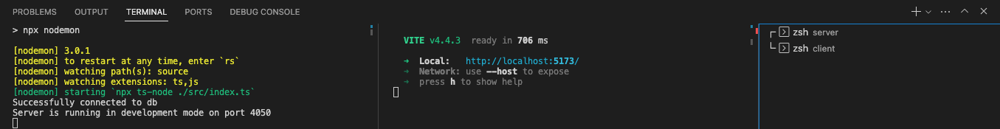

# EditMovies

## Features

- Viewer

  - Can see the movies and their information
  - Can see the ratings and comments
  - Can login/register as an User

- User

  - Can see the movies and their information
  - Can see the ratings and comments
  - Can rate and comment

- Admin
  - Can see the movies and their information
  - Can see the ratings and comments
  - Can rate and comment
  - Can add new movies
  - Can edit and delete existing movies

## Getting Started

- In the server folder create a ".env" file and paste the information provided in the slack

- Open 2 terminals

  - In the first one type "cd server"
  - Then "npm i"
  - Followed by "npm run dev"

- Now the database should be connected to the Port 4050

  - In the second terminal type "cd client"
  - Then "npm i"
  - Followed by "npm run dev"
  - Now you can type "o" to open the project

##

This is how your terminals should look like:

